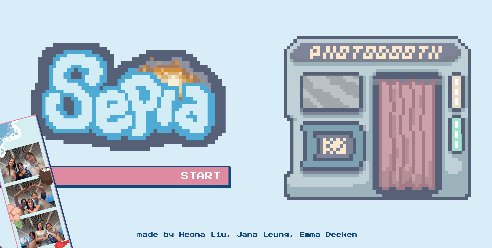

# SEPIA



This virtual photobooth allows users to upload three picture using a timed capture camera and formats them as a downloadable photo strip. There are four themes available to choose from, and each comes with drag-and-drop stickers to embellish the strip.

Heona Liu, Jana Leung, and Emma Deeken as part of Hack Club's Sunbeam Boston event.

## TRY IT

Access through this [link](sunbeam-sepia.vercel.app)!

## Inspiration

Jana, Emma, and Heona wanted a space to keep memories and capture them with the people they care most about in a fun, memorable, unique way. Additionally, we often walk past photo booths but hesitate to go in because it sometimes costs a lot of money! Sepia was a way to keep things happy while being accessible anywhere across the world.

## PRIVACY


User photos are only used locally. They are never uploaded online and are not stored when the program is terminated, unless the user chooses to download them.


## CONTRIBUTIONS

Liu developed the basic framework for the project, handled the landing page, and created the drag and drop functionality, and photostrip editing functionality.


Leung created original artwork for the photo strip themes, embellishments, and other graphics used by the program.


Deeken handled the photo capture and download button functionalities.

## TECH STACK
- Framework: ReactJS, NodeJS, TailwindCSS, Canvas API, OpenMediaAPI
- Resprite (art)

## FUTURE IDEAS

- Creating more themes
- Accessible on mobile as a website or app via React Native


## Organization:


```
sunbeam-sepia/
├── index.html
├── vite.config.js
├── tailwind.config.js
├── package.json
├── public/
│   ├── favicon.svg
│   └── icons.svg
└── src/
  ├── main.jsx                     # app entry point, wraps the router in PhotoboothProvider
  ├── router.jsx                   # react-router routes: "/", "/capture", "/edit"
  ├── index.css                    # tailwind directives + pixel-theme button/frame utilities
  │
  ├── pages/
  │   ├── LandingPage.jsx          # hero (logo, START button, team credits)
  │   ├── CameraPage.jsx           # countdown capture flow, retake/continue controls
  │   └── EditorPage.jsx           # strip compositor: theme bg/overlay, photos, drag-and-drop stickers
  │
  ├── hooks/
  │   └── useCamera.js             # getUserMedia setup/teardown, countdown, capture/retake logic
  │
  ├── context/
  │   └── PhotoboothContext.jsx    # shares captured photos between CameraPage and EditorPage
  │
  ├── assets/
  │   ├── sepia.png, Main.PNG, Favicon.PNG      # branding images
  │   ├── templates/                            # per-theme strip backgrounds + overlays
  │   │   └── {winter,beach,study,ocean}-{bg,over}.PNG
  │   └── stickers/                             # per-theme draggable sticker sets
  │       └── {winter,beach,study,ocean}/{theme}-{1..4}.PNG
  │
  ├── team-strip.png               # tilted photo strip graphic on the landing page
  │
  └── (components/, App.jsx, hooks/useCanvasExport.js, utils/)
      # scaffolding from the original file layout; left empty and unused —
      # everything ended up living directly in pages/ instead
```

made with <3 by Heona Liu, Jana Leung, Emma Deeken
